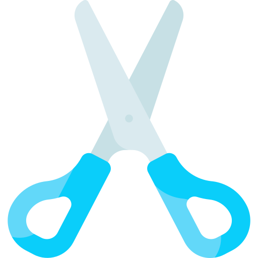

# Jan-Ken-Jojo
This is a mix of your favorite classic game of all time-- rock, paper, scissors!

 

This version of rock-paper-scissors is named after the Japanese version of the game that children in schoolyards all over Japan use to settle disputes. After one game of Jan-Ken-Po, as it's lovingly called, you can settle any dispute.

The name for the game is a fusion of Jan-Ken-Po and JoJo!

### Table of Contents
- [Overview](#overview-and-project-goals)
- [Features](#features)
- [How does this work?](#how-does-the-app-work)
- [Project Reflection](#project-reflection)
- [How To Contribute](#want-to-contribute)
- [Instructions for Running Project](#instructions-for-running-project)
- [Authors and Contributors](#credits)

## Overview and Project Goals
The [goal](https://frontend.turing.edu/projects/module-1/rock-paper-scissors-solo.html) of this solo project that was made for Mod1 at [Turing School of Software and Design](https://turing.io/) is to build a Rock, Paper, Scissors game completely from from scratch using HTML, CSS, and Vanilla Javascript.

## Why was this project created?
To solidify and demonstrate the understanding of:
1. writing clean and DRY HTML, CSS, and JS
2. using localStorage to persist data
3. finessing event delegation to handle similar event listeners
4. understanding the difference between the data model and how the data is displayed on the DOM
5. iterating/ filtering through DOM elements with for loops.
6. understanding the interaction between multiple class files
7. developing and using my problem solving process to break down large problems, solve things step by step, and trust myself to come up with an answer.

## Features
* A website that allows users to play two different games of rock, paper, scissors. The first game is the classic game, and the user can click and select a hand to throw. The computer throws back a generated hand, and both choices are briefly displayed on the screen, along with tokens that show the "hero" choice, the user selection, as well as "enemy" choice, the computer-generated selection. Additionally, the user can change games, using the change game button,. This will take them back to the main screen where they can click upon the Jojo Game section, which displays the logic rules describing which fighters's stand trumps the other fighter's stand. There is an underlined link to all of the players data on the Jojo wiki, since the game is themed after [Jojo's Bizarre Adventures Anime](https://en.wikipedia.org/wiki/JoJo%27s_Bizarre_Adventure).
* Classic game
* Jojo-themed game
* Ability to change game with buttons
* Ability to startover the game and clear wins
* Audio play-back that happens when a user decides to startover

**[Back to top](#table-of-contents)**

## How does the app work?

#### Please watch the video for a demo!

<iframe width="400" height="315" src="https://www.youtube.com/embed/16vQtc30f_0" frameborder="0" allowfullscreen> </iframe>

## Want to contribute?
Please fork the repo and submit a pull request. I'd love to continue to develop the game with JoJo fans.

## Instructions for Running Project
1. Clone this [repository.](hhttps://github.com/shayan-golafshani/jan-ken-po)
2. `cd` into the repository in your terminal.
3. Then `open index.html` in your terminal to view it on your browser.

## Technologies Used

  
  
  
  
  

## Project Reflection

#### Wins
* I got the game functioning and saving wins with local storage.
* Created JoJo-themed styling with CSS.
* Gained a better understanding of class to class interactions and
  how to use class methods.

#### Challenges
* Extracting DOM manipulation logic out of my game class once it was already working 
* Asking enough questions to fully understand what is expected in the end product

#### Overall Impressions
* I'm proud of my work, it works!
* I could try to come up with an article explaining the character logic.
* I learned how to work independently without referencing outside sources.
* Also learned that it's good to get done early, so that I can set aside a lot of time and energy for refactoring and improving my code to make it more easily understood. I more than halfed the code I originally wrote.

#### Future Features
* Make background flash when sound is playing 
* Add responsive design principles for mobile use
* Add more characters from the anime
* Add more css animations, css psuedo-selectors, and additional sounds

## Credits

#### Author
<table>
    <tr>
         <td> Shayan Golafshani <a href="https://github.com/shayan-golafshani">GH</a>
         </td>
    </tr>
    <tr>
        <td>
          
        </td>
    </tr>
</table>

#### Key-Contributor

<table>
    <tr>
         <td> Riley Martin <a href="https://github.com/RMartin0717">GH</a>
         </td>
    </tr>
    <tr>
        <td>
          
        </td>
    </tr>
</table>

#### Project Manager

<table>
    <tr>
         <td> Heather Faerber <a href="https://github.com/hfaerber">GH</a>
         </td>
    </tr>
    <tr>
        <td>
          
        </td>
    </tr>
</table>

**************************************************************************
###### This project was created for [Turing School of Software and Design](https://turing.io/)
###### 2021/04/27
**[Back to top](#table-of-contents)**